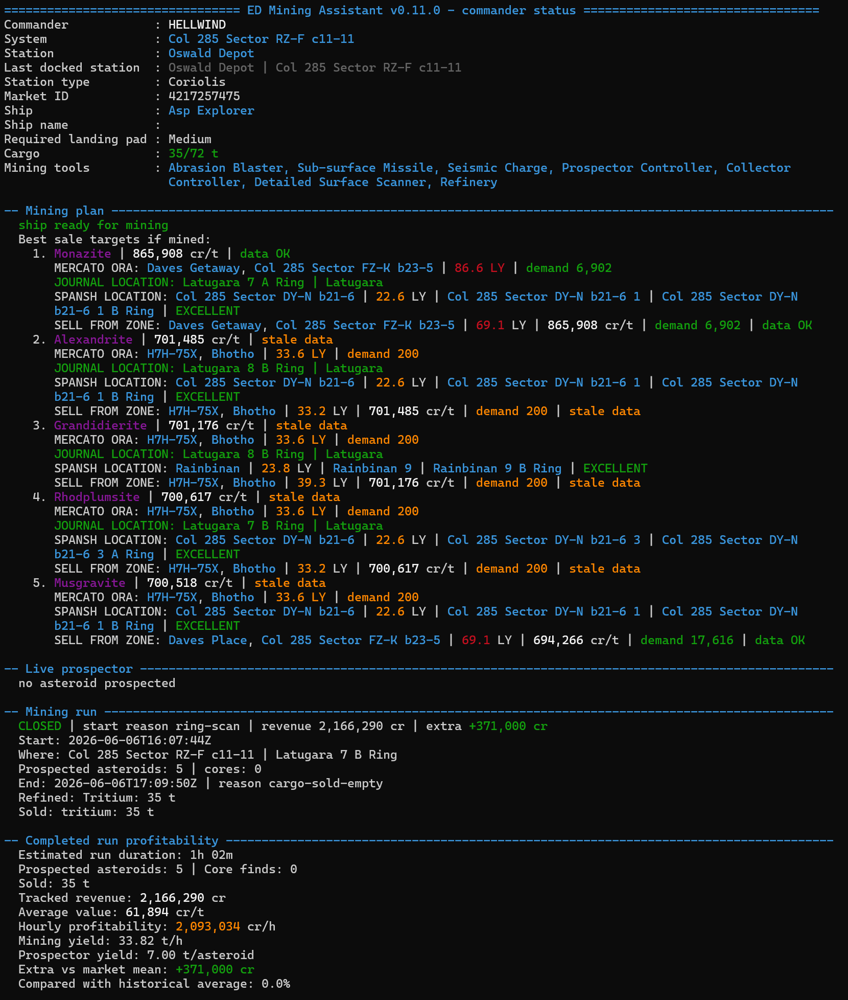
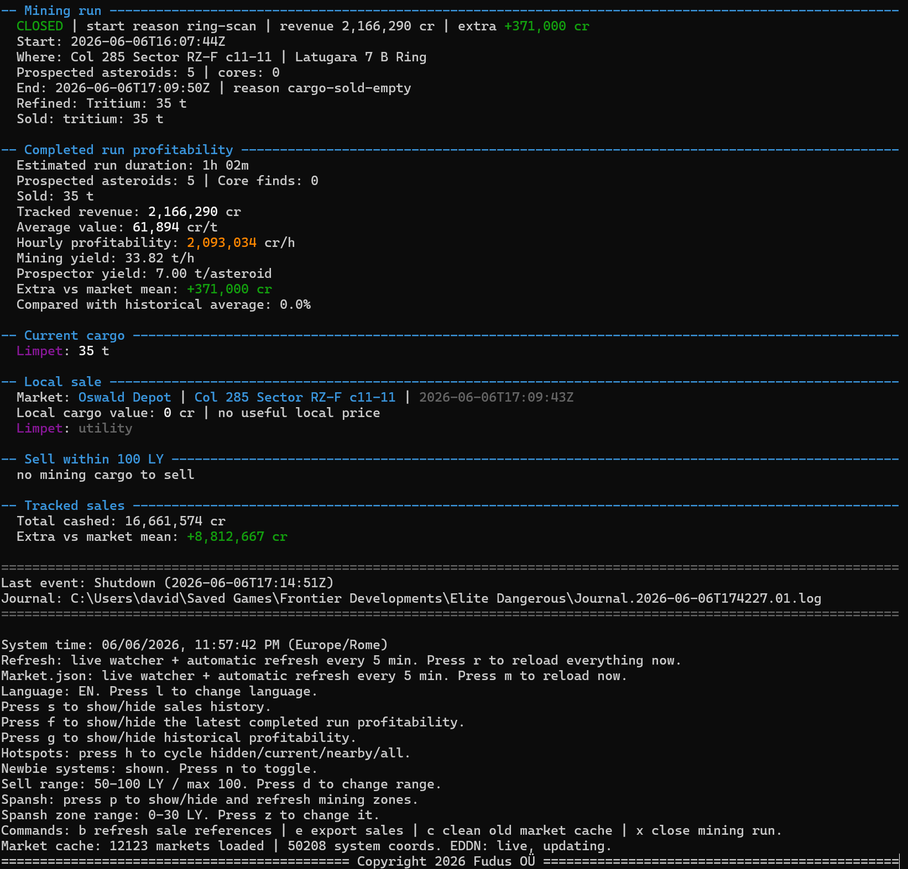

# ED Mining Assistant

ED Mining Assistant is a local console companion for Elite Dangerous mining.

It combines the local game Journal, Cargo.json and Market.json with optional live EDDN market data and Spansh body/ring data to help commanders decide:

- what is currently worth mining
- where suitable rings and known hotspots are located
- where to sell from the mining zone
- whether the current local market is competitive
- how profitable each completed mining run was

Current public testing build: **0.11.0**

## Main Features

- Unified mining plan combining EDDN markets, local Journal hotspots and Spansh mining zones.
- Live prospector assessment with `MINE`, `CONSIDER` and `SKIP` guidance.
- Nearby cargo sale comparison with demand, data freshness and landing-pad checks.
- Separate tracking of the ship's current system and last docked station, so old market data cannot be mistaken for the current location.
- Independent sell-market and Spansh-zone distance ranges.
- Persistent mining-run and sales history.
- Completed-run profitability and weighted historical profitability reports.
- Italian, English, French and German console translations.
- Consistent color coding for opportunities, warnings, locations, commodities and economic values.

## Screenshots

### Unified Mining Plan

Market opportunities, Journal hotspots and Spansh mining zones are combined into one ranked plan.



### Mining Run Profitability

Completed runs include revenue, yield, hourly profitability and comparison with historical results.



## Data Sources

- **Local Elite Dangerous files:** commander state, cargo, market, loadout and mining events.
- **[EDDN](https://eddn.edcd.io/):** optional live community market updates.
- **[Spansh](https://spansh.co.uk/):** known bodies, rings, reserves and hotspot signals.

Spansh hotspot counts identify known signals; they do not guarantee asteroid yield. Market recommendations depend on the age and coverage of community data.

## Acknowledgements

Thanks to the EDDN maintainers and data-contributing commanders, and to Spansh for making community exploration data searchable. Their services make the live market and mining-zone features possible.

Elite Dangerous is a trademark of Frontier Developments plc. ED Mining Assistant is an independent community project and is not affiliated with, endorsed by or sponsored by Frontier Developments, EDDN or Spansh.

## Distribution

ED Mining Assistant is currently freeware/proprietary software. The source code is not publicly distributed.

The launcher scripts are public and inspectable:

- [`start.cmd`](start.cmd)
- [`start-eddn.cmd`](start-eddn.cmd)

This is a console testing build, not the planned overlay application.

## Requirements

- Windows 10 or Windows 11
- Elite Dangerous
- Node.js 20 or newer installed
- Access to the local Elite Dangerous data folder:

```text
%userprofile%\Saved Games\Frontier Developments\Elite Dangerous\
```

## Quick Start

1. Download `ED-Mining-Assistant-v0.11.0-win-x64.zip`.
2. Extract the complete archive.
3. Double-click `start-eddn.cmd` for live EDDN market updates.
4. Alternatively, use `start.cmd` without the EDDN listener.

From PowerShell:

```powershell
.\start-eddn.cmd
```

PowerShell requires the `.\` prefix for programs in the current folder.

The app detects the system language when possible. Press `l` to change it.

## Avvio Rapido Italiano

1. Scarica `ED-Mining-Assistant-v0.11.0-win-x64.zip`.
2. Estrai l'intero archivio.
3. Avvia `start-eddn.cmd` per usare anche gli aggiornamenti mercato EDDN.
4. In alternativa usa `start.cmd` senza listener EDDN.

Da PowerShell:

```powershell
.\start-eddn.cmd
```

PowerShell richiede il prefisso `.\` per eseguire un programma dalla cartella corrente.

L'app rileva automaticamente la lingua di sistema quando possibile. Premi `l` per cambiarla.

## Runtime Controls

- `r`: reload Journal, Cargo, Market, caches and histories
- `m`: reload Market.json
- `l`: change language
- `s`: show/hide sales history
- `f`: show/hide latest completed-run profitability
- `g`: show/hide historical profitability
- `d`: cycle sell-market range
- `z`: cycle Spansh zone band: 0-30, 30-50, 50-100, 100-200 LY
- `p`: show/hide and refresh detailed Spansh zones
- `h`: cycle locally known hotspot views
- `n`: show/hide newbie and permit-risk systems
- `b`: refresh sales reference prices
- `e`: export sales history
- `c`: clean old market cache
- `x`: manually close the active mining run
- `Ctrl+C`: exit

## Privacy and Network Use

The app does not request Frontier credentials or an ED account login.

Local data, caches and histories are stored in `.runtime/`. When enabled, the app receives public EDDN market messages and sends anonymous search requests to Spansh using the current system coordinates and selected distance band.

See [Security and Privacy](docs/security-and-privacy.md).

## Verify v0.11.0

Expected files:

```text
ED-Mining-Assistant-v0.11.0-win-x64.zip
ED-Mining-Assistant-v0.11.0-win-x64.zip.sha256
```

PowerShell verification:

```powershell
Get-FileHash .\ED-Mining-Assistant-v0.11.0-win-x64.zip -Algorithm SHA256
```

SHA256:

```text
dcb87216ac174e4385b0f18ac6664e43b0b31331039de7323305f82f315034f6
```

VirusTotal reports:

- [Release archive](https://www.virustotal.com/gui/file/dcb87216ac174e4385b0f18ac6664e43b0b31331039de7323305f82f315034f6)
- [`start.cmd`](https://www.virustotal.com/gui/file/f97a096d870e3cdca64390469e881f9111a41f735ccbb29eef31c5375966befd)
- [`start-eddn.cmd`](https://www.virustotal.com/gui/file/df306a226bfc700b307005f96338ba687cfe0f1aace13c97b252a2f6f107fb26)

## Versioning Note

`v0.10.x` was used for internal development and testing. `v0.11.0` is the next planned public testing release after `v0.9.2`.

## Project Direction

The next major target is a Windows overlay built with Electron, React, Vite and TypeScript. The console version remains the engine and diagnostic build.
